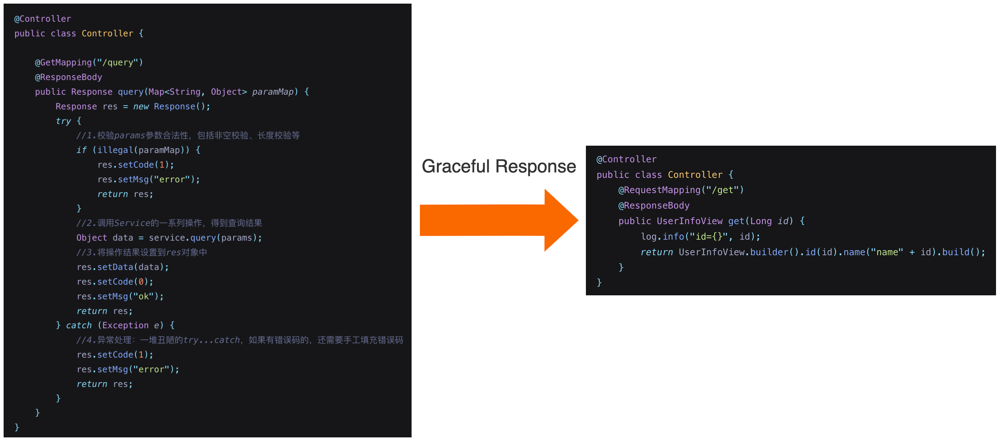

<div align=center></div>


[](https://github.com/feiniaojin/graceful-response/stargazers)
[](https://github.com/feiniaojin/graceful-response/network)


# 1. 项目介绍

Graceful Response是Spring Boot技术体系下的响应处理解决方案，可以帮助开发者优雅地完成包括统一响应格式数据封装、全局异常处理、错误码填充、异常消息国际化等处理过程，提高开发效率，提高代码质量。



代码仓库如下，欢迎star！

- GitHub

```text
https://github.com/feiniaojin/graceful-response
```

# 2. 功能列表
- 统一返回值封装
- void返回类型封装
- 全局异常处理
- 参数校验错误码
- 自定义响应体，适应不同项目的需求
- 断言增强并且填充错误码和异常信息到Response
- 异常别名，适配外部异常
- 例外请求放行
- 第三方组件适配（Swagger、actuator、FastJson序列化等）

更多功能，请到[文档中心](https://doc.feiniaojin.com/graceful-response/home.html)的项目主页进行了解。

# 3. 核心应用场景

目前，业界使用Spring Boot进行接口开发时，往往存在效率低下、重复劳动、可读性差等问题。以下伪代码相信大家非常熟悉，我们大部分项目的Controller接口都是这样的。

```java
@Controller
public class Controller {
    
    @GetMapping("/query")
    @ResponseBody
    public Response query(Map<String, Object> paramMap) {
        Response res = new Response();
        try {
            //1.校验params参数合法性，包括非空校验、长度校验等
            if (illegal(paramMap)) {
                res.setCode(1);
                res.setMsg("error");
                return res;
            }
            //2.调用Service的一系列操作，得到查询结果
            Object data = service.query(params);
            //3.将操作结果设置到res对象中
            res.setData(data);
            res.setCode(0);
            res.setMsg("ok");
            return res;
        } catch (Exception e) {
            //4.异常处理：一堆丑陋的try...catch，如果有错误码的，还需要手工填充错误码
            res.setCode(1);
            res.setMsg("error");
            return res;
        }
    }
}
```

主要体现在以下三个点：

**价值低下：** Controller层的代码应该尽量简洁，上面的伪代码其实只是为了将数据查询的结果进行封装，使其以统一的格式进行返回。

**重复劳动：** 以上捕获异常、封装执行结果的操作，每个接口都会进行一次，因此造成大量重复劳动。

**可读性低：** 上面的核心代码被淹没在许多冗余代码中，很难阅读，如同大海捞针。

Graceful Response可以帮助开发者完成响应数据封装、异常处理、错误码填充等过程，使代码更精简更清晰，可以使开发者有更多的注意力聚焦在业务代码上。效果如下：

```java
@Controller
public class Controller {
    @RequestMapping("/get")
    @ResponseBody
    public UserInfoView get(Long id) {
        log.info("id={}", id);
        return UserInfoView.builder().id(id).name("name" + id).build();
    }
}
```

# 4.快速入门

## 4.1 maven依赖

```xml
<dependency>
    <groupId>com.feiniaojin</groupId>
    <artifactId>graceful-response</artifactId>
    <version>{latest.version}</version>
</dependency>
```

## 4.2 版本选择

**Latest Version**

| Spring Boot版本 | maven版本   | graceful-response-example分支 |
| --------------- | ----------- | ----------------------------- |
| 2.x             | 3.5.2-boot2 | 3.5.2-boot2                   |
| 3.x             | 3.5.2-boot3 | 3.5.2-boot3                   |

> 注意，boot2版本的Graceful Response源码由单独的仓库进行维护，boot2和boot3除了支持的SpringBoot版本不一样，其他实现完全一致。boot2版本地址：[graceful-response-boot2](https://github.com/feiniaojin/graceful-response-boot2)

## 4.3 注解开启

在启动类中引入@EnableGracefulResponse注解，即可启用Graceful Response组件。

```java
@EnableGracefulResponse
@SpringBootApplication
public class ExampleApplication {
    public static void main(String[] args) {
        SpringApplication.run(ExampleApplication.class, args);
    }
}
```

## 4.4 代码编写

- Controller

引入Graceful Response后，我们不需要再手工进行查询结果的封装，直接返回实际结果即可，Graceful Response会自动完成封装的操作。

Controller层示例如下。

```java
@Controller
public class Controller {
    @RequestMapping("/get")
    @ResponseBody
    public UserInfoView get(Long id) {
        log.info("id={}", id);
        return UserInfoView.builder().id(id).name("name" + id).build();
    }
}
```

在示例代码中，Controller层的方法直接返回了UserInfoView对象，没有进行封装的操作，但经过Graceful Response处理后，我们还是得到了以下的响应结果。

```json
{
  "status": {
    "code": "0",
    "msg": "ok"
  },
  "payload": {
    "id": 1,
    "name": "name1"
  }
}
```

而对于命令操作（Command）尽量不返回数据，因此command操作的方法的返回值应该是void，Graceful
Response对于对于返回值类型void的方法，也会自动进行封装。

```java
public class Controller {
    @RequestMapping("/command")
    @ResponseBody
    public void command() {
        //业务操作
    }
}
```

成功调用该接口，将得到：

```json
{
  "status": {
    "code": "200",
    "msg": "success"
  },
  "payload": {}
}
```

- Service层

在引入Graceful Response前，有的开发者在定义Service层的方法时，为了在接口中返回异常码，干脆直接将Service层方法定义为Response，淹没了方法的正常返回值。

传统项目直接返回Response的Service层方法：

```java
/**
 * 直接返回Reponse的Service
 * 不规范
 */
public interface Service {
    public Reponse commandMethod(Command command);
}
```

Graceful Response引入@ExceptionMapper注解，通过该注解将异常和错误码关联起来，这样Service方法就不需要再维护Response的响应码了，直接抛出业务异常，由Graceful Response进行异常和响应码的关联。
@ExceptionMapper的用法如下。

```java
/**
 * NotFoundException的定义，使用@ExceptionMapper注解修饰
 * code:代表接口的异常码
 * msg:代表接口的异常提示
 */
@ExceptionMapper(code = "1404", msg = "找不到对象")
public class NotFoundException extends RuntimeException {

}
```

Service接口定义：

```java
public interface QueryService {
    UserInfoView queryOne(Query query);
}
```

Service接口实现：

```java
public class QueryServiceImpl implements QueryService {
    @Resource
    private UserInfoMapper mapper;

    public UserInfoView queryOne(Query query) {
        UserInfo userInfo = mapper.findOne(query.getId());
        if (Objects.isNull(userInfo)) {
            //这里直接抛自定义异常
            throw new NotFoundException();
        }
        //……后续业务操作
    }
}
```

当Service层的queryOne方法抛出NotFoundException时，Graceful
Response会进行异常捕获，并将NotFoundException对应的异常码和异常信息封装到统一的响应对象中，最终接口返回以下JSON。

```json
{
  "status": {
    "code": "1404",
    "msg": "找不到对象"
  },
  "payload": {}
}
```

# 5.文档和示例
## 5.1 文档中心
```text
https://doc.feiniaojin.com/graceful-response/home.html
```
[点击访问文档中心](https://doc.feiniaojin.com/graceful-response/home.html
)
## 5.2 代码示例
- Gitee
```text
https://github.com/feiniaojin/graceful-response-example
```
- GitHub
```text
https://gitee.com/igingo/graceful-response-example
```

# 6.交流和反馈

欢迎通过以下二维码联系作者、并加入Graceful Response用户交流群，申请好友时请备注“GR”。

<div></div>

公众号: 悟道领域驱动设计

<div></div>

# 7.贡献者

<a href="https://github.com/feiniaojin/graceful-response/graphs/contributors">
  
</a>

# 8.star

[](https://star-history.com/#feiniaojin/graceful-response&Date)


