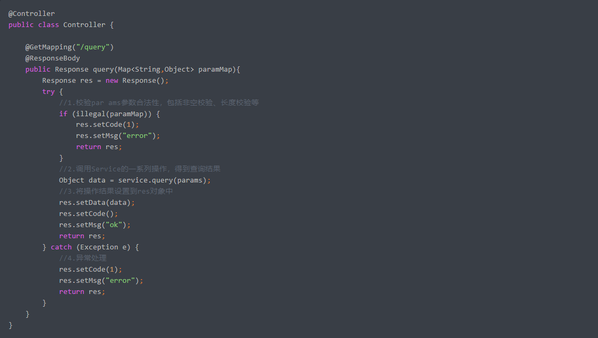
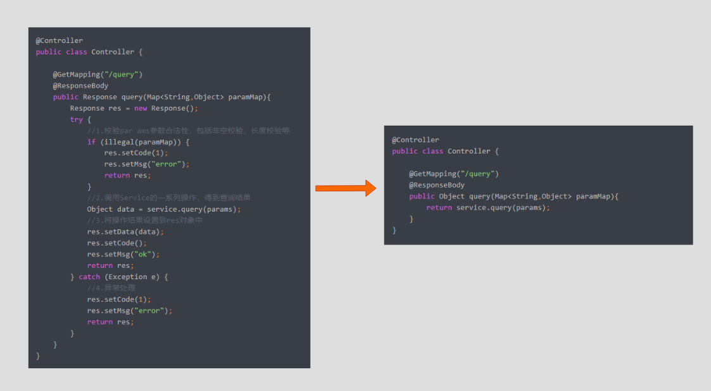

<div align=center></div>


[](https://github.com/feiniaojin/graceful-response/stargazers)
[](https://github.com/feiniaojin/graceful-response/network)


# 1. 背景

**Spring Boot接口开发现状**

目前，业界使用Spring Boot进行接口开发时，往往存在效率底下、重复劳动、可读性差等问题。以下伪代码相信大家非常熟悉，我们大部分项目的Controller接口都是这样的。



这段伪代码存在什么样的问题呢？

1. 效率低下。Controller层的代码应该尽量简洁，上面的伪代码其实只是为了将数据查询的结果进行封装，使其以统一的格式进行返回。
2. 重复劳动。以上捕获异常、封装执行结果的操作，每个接口都会进行一次，因此造成大量重复劳动
3. 可读性低。上面的核心代码被淹没在许多冗余代码中，很难阅读，如同大海捞针

Graceful Response这个组件解决这样的问题而诞生的。

# 2.简介

Graceful Response是一个Spring Boot技术栈下的优雅响应处理器，提供一站式统一返回值封装、全局异常处理、自定义异常错误码等功能，使用Graceful
Response进行web接口开发不仅可以节省大量的时间，还可以提高代码质量，使代码逻辑更清晰。

## 2.1 功能点

1. 第三方组件适配（Swagger、actuator、JSON序列化等）
2. 支持自定义响应体，满足不同项目的需求
3. 自定义异常信息
4. 断言增强并且填充异常信息到Response
5. 例外请求放行
6. 异常别名
7. 常用配置项

引入graceful response的效果如下：




# 3.快速入门

## 3.1 版本选择

**Latest Version**

| Spring Boot版本 | Graceful Response版本 | graceful-response-example分支 |
| --------------- | --------------------- | ----------------------------- |
| 2.x             | 3.5.2-boot2           | 3.5.2-boot2                   |
| 3.x             | 3.5.2-boot3           | 3.5.2-boot3                   |

> 注意，boot2版本的Graceful Response源码由单独的仓库进行维护，boot2和boot3除了支持的SpringBoot版本不一样，其他实现完全一致。boot2版本地址：[graceful-response-boot2](https://github.com/feiniaojin/graceful-response-boot2)

## 3.2 maven依赖

```xml
<dependency>
    <groupId>com.feiniaojin</groupId>
    <artifactId>graceful-response</artifactId>
    <version>{latest.version}</version>
</dependency>
```


## 3.3 开启Graceful Response

在启动类中引入@EnableGracefulResponse注解，即可启用Graceful Response组件。

```java
@EnableGracefulResponse
@SpringBootApplication
public class ExampleApplication {
    public static void main(String[] args) {
        SpringApplication.run(ExampleApplication.class, args);
    }
}
```

## 3.4 Controller层

引入Graceful Response后，我们不需要再手工进行查询结果的封装，直接返回实际结果即可，Graceful Response会自动完成封装的操作。

Controller层示例如下。

```java
@Controller
public class Controller {
    @RequestMapping("/get")
    @ResponseBody
    public UserInfoView get(Long id) {
        log.info("id={}", id);
        return UserInfoView.builder().id(id).name("name" + id).build();
    }
}
```

在示例代码中，Controller层的方法直接返回了UserInfoView对象，没有进行封装的操作，但经过Graceful Response处理后，我们还是得到了以下的响应结果。

```json
{
  "status": {
    "code": "0",
    "msg": "ok"
  },
  "payload": {
    "id": 1,
    "name": "name1"
  }
}
```

而对于命令操作（Command）尽量不返回数据，因此command操作的方法的返回值应该是void，Graceful
Response对于对于返回值类型void的方法，也会自动进行封装。

```java
public class Controller {
    @RequestMapping("/command")
    @ResponseBody
    public void command() {
        //业务操作
    }
}
```

成功调用该接口，将得到：

```json
{
  "status": {
    "code": "200",
    "msg": "success"
  },
  "payload": {}
}
```

## 3.5 Service层

在引入Graceful Response前，有的开发者在定义Service层的方法时，为了在接口中返回异常码，干脆直接将Service层方法定义为Response，淹没了方法的正常返回值。

传统项目直接返回Response的Service层方法：

```java
/**
 * 直接返回Reponse的Service
 * 不规范
 */
public interface Service {
    public Reponse commandMethod(Command command);
}
```

Graceful Response引入@ExceptionMapper注解，通过该注解将异常和错误码关联起来，这样Service方法就不需要再维护Response的响应码了，直接抛出业务异常，由Graceful Response进行异常和响应码的关联。
@ExceptionMapper的用法如下。

```java
/**
 * NotFoundException的定义，使用@ExceptionMapper注解修饰
 * code:代表接口的异常码
 * msg:代表接口的异常提示
 */
@ExceptionMapper(code = "1404", msg = "找不到对象")
public class NotFoundException extends RuntimeException {

}
```

Service接口定义：

```java
public interface QueryService {
    UserInfoView queryOne(Query query);
}
```

Service接口实现：

```java
public class QueryServiceImpl implements QueryService {
    @Resource
    private UserInfoMapper mapper;

    public UserInfoView queryOne(Query query) {
        UserInfo userInfo = mapper.findOne(query.getId());
        if (Objects.isNull(userInfo)) {
            //这里直接抛自定义异常
            throw new NotFoundException();
        }
        //……后续业务操作
    }
}
```

当Service层的queryOne方法抛出NotFoundException时，Graceful
Response会进行异常捕获，并将NotFoundException对应的异常码和异常信息封装到统一的响应对象中，最终接口返回以下JSON。

```json
{
  "status": {
    "code": "1404",
    "msg": "找不到对象"
  },
  "payload": {}
}
```

## 3.6 参数校验

Graceful Response对JSR-303数据校验规范和Hibernate Validator进行了增强，Graceful Response自身不提供参数校验的功能，但是用户使用了Hibernate
Validator后，Graceful Response可以通过@ValidationStatusCode注解为参数校验结果提供响应码，并将其统一封装返回。

例如以下的UserInfoQuery。

```java

@Data
public class UserInfoQuery {
    @NotNull(message = "userName is null !")
    @Length(min = 6, max = 12)
    @ValidationStatusCode(code = "520")
    private String userName;
}
```

UserInfoQuery对象中定义了@NotNull和@Length两个校验规则，在未引入Graceful Response的情况下，会直接抛出异常；

在引入Graceful Response但是没有加入@ValidationStatusCode注解的情况下，会以默认的错误码进行返回；

在上面的UserInfoQuery中由于使用了@ValidationStatusCode注解，并指定异常码为520，则当userName字段任意校验不通过时，都会使用异常码520进行返回，如下。

```json
{
  "status": {
    "code": "520",
    "msg": "userName is null !"
  },
  "payload": {}
}
```

而对于Controller层直接校验方法入参的场景，Graceful Response也进行了增强，如以下Controller。

```java
public class Controller {

    @RequestMapping("/validateMethodParam")
    @ResponseBody
    @ValidationStatusCode(code = "1314")
    public void validateMethodParam(
            @NotNull(message = "userId不能为空") Long userId,
            @NotNull(message = "userName不能为空") Long userName) {
        //省略业务逻辑
    }
}
```

如果该方法入参校验触发了userId和userName的校验异常，将以错误码1314进行返回，如下。

```json
{
  "status": {
    "code": "1314",
    "msg": "userId不能为空"
  },
  "payload": {}
}
```

## 3.7 自定义Response格式

Graceful Response内置了两种风格的响应格式，并通过graceful-response.response-style进行配置。

graceful-response.response-style=0，或者不配置（默认情况），将以以下的格式进行返回：

```json
{
  "status": {
    "code": 1007,
    "msg": "有内鬼，终止交易"
  },
  "payload": {
  }
}
```

graceful-response.response-style=1，将以以下的格式进行返回：

```json
{
  "code": "1404",
  "msg": "not found",
  "data": {
  }
}
```

如果这两种格式均不满足业务需要，Graceful Response也支持用户自定义Response，关于自定义响应体的技术实现，请到[文档中心](https://doc.feiniaojin.com)进行了解。

# 4.相关链接

[文档中心](https://doc.feiniaojin.com)

[项目示例](https://github.com/feiniaojin/graceful-response-example)

# 5.star

[](https://star-history.com/#feiniaojin/graceful-response&Date)

# 6.贡献者

<a href="https://github.com/feiniaojin/graceful-response/graphs/contributors">
  
</a>

# 7.学习交流

欢迎通过以下二维码联系作者，并加入Graceful Response用户交流群，申请好友时请备注“GR”。

<div></div>

公众号: 悟道领域驱动设计

<div></div>


